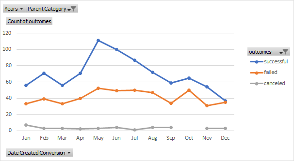

# Kickstarting with Excel

## Overview of Project
Using Excel and PivotTables to analyze Kickstarter data to understand how campaigns did in relation to their launch dates and funding goals.

### Purpose
Using the Kickstarter dataset, this analysis will examine other campaigns in the theater category and compare campaign outcomes by their launch dates in months. The percent of successful, failed, and canceled campaigns are calculated and then compared by their targeted goal and graphed.

## Analysis and Challenges

### Analysis of Outcomes Based on Launch Date
To understand theater outcomes based on launch date, the year of each launch date was extracted into a new column in the Kickstarter dataset. A PivotTable was created using the Kickstarter sheet. “Date Created” was set to “Rows”, “Outcomes” to “Columns”, and “Count of Outcomes” set to “Values” with filters for “Years” and “Parent Category”. The Parent Category filter is set to “theater” only and “Years” to “All”. This table shows only the theatre Kickstarter campaigns for all years categorized by the month (see Image 1). 

**Image 1** 

Since the data can change yearly, it’s important to make sure that all years are selected for years. The “Count of Outcomes” is filtered to show Canceled, Successful, and Failed outcomes as the Live outcomes are ongoing and are not needed for this analysis. Outcomes are sorted in descending order. After the PivotTable was complete, a PivotChart was created using a line graph to easily visualize the comparisons (see Image 2). 

 
**Image 2**

### Analysis of Outcomes Based on Goals
To see the outcomes based on goals, only the outcomes in the subcategory plays were used. The targeted goal amount is broken into increments of $5000 with a range of less than $1000 to greater than $50,000. The total number of projects for each increment was calculated and sorted by outcomes in a new table. Then percent for Successful, Failed, and Canceled campaigns were calculated for each increment (See Image 3). 

 
**Image 3**

A line chart was created using this new dataset to see how campaigns did as the amount of the goals increased (See Image 4).

**Image 4**

### Challenges and Difficulties Encountered
The most challenging aspect of this analysis was trying to calculate the different ranges of goals without having to type a formula for each range under each outcome in image 3. When typing out each formula for the goal ranges under the outcome “Successful”, add ‘$’ of every column. For example, instead of F:F type $F:$F. This will allow the formula to be copied and pasted into subsequent outcome columns without incremental changes and lowers the risk of human error or typos since the formulas are mostly complete and verified to work.  Change the referenced outcome in the formula to the respective outcome being calculated.
Another challenge is knowing if the formulas are calculating or populating the correct data. To verify the formulas used to populate the Outcomes by Goals, filter the dataset on the Kickstarter sheet. For example, to verify the number of successful plays under $1000, filter Subcategory to “plays”, Outcome to “Successful”, and Goals to “<1000”. Then verify the number of rows in Kickstarter matches the number calculated for Successful and Goals less than $1000. Change the filters to verify other ranges of goals.

## Results

- **What are two conclusions you can draw about the Outcomes based on Launch Date?**

The graph, Outcomes Vs Launch Dates (Image 2), suggests that campaigns started in May and June had the highest success rate. May campaigns were 2 times more likely to succeed than fail followed closely by June. Even though May also had the highest number of failures overall, there were twice as many successful campaigns. The data suggests that May is the best month to launch a campaign while December is not. Image 2 shows this relationship where lines for successful and failed seems to overlap. Campaigns launched in December success and failure rate are about the same suggesting that December is worst month to launch a campaign. In December targeted pledgees may withhold money due to the holiday spending and end of year budgets. 

- **What can you conclude about the Outcomes based on Goals?**

Looking at the graph, Outcomes Based on Goals (Image 3), shows campaigns with lower goals tend to be more successful as lower goals are easier to reach. The gap between successful and failed narrows significantly after $5000 but the percentage of successful campaigns doesn’t fall below the percentage of failed campaigns until the goal is $20,000 or more. Although the expectation is that the higher the goal the more likely it will fail, campaigns with goals between $35,000 and $39,999 had more successes than failures. Only 6 campaigns are in the range and are therefore outliers and are not a good representation of all the data set. 

- **What are some limitations of this dataset?**

One limitation for this dataset is being limited to years 2009 to 2017. The most recent data is almost four years old. Given that there is a worldwide pandemic that affects mostly everything, these numbers wouldn’t accurately reflect how well a campaign for plays would fare today. The theatre industry has been significantly impacted during the pandemic, so the question remains of if investors or donors be willing to back campaigns for plays as much as they did pre pandemic. At minimum, getting the most recent available data would be best. Missing data is also another limitation. The dataset when filtered for theater category seems to be concentrated into 3 years: 2014, 2015, and 2016. The data for 2017 is incomplete. The years before 2014 also seem incomplete. This may be due to Kickstarter being new and not many people used it, so it really didn’t take off until 2014. The missing data for the years used in this dataset would have to be verified and checked. Another limitation is that this dataset will not tell us the impact of outside factors had on the campaigns such as social media reach and engagements. How well a campaign markets itself would determine how well a campaign does.  It could be possible to survey successful and failed campaigns and then determine if there are some common marketing techniques. Then I’d want to know when and how soon to start marketing a project and for how long. These are all things that would affect success and failure rates that this dataset is unable to.

- **What are some other possible tables and/or graphs that we could create?** 

Other graphs one could make are a histogram and PivotTable/PivotChart. The histogram would show the number of successful and failed campaigns in the parent category theatre by dollar amounts and characterize the distribution. A pivot table showing the successful, failed, and canceled outcomes over the years could show possible trends or fluctuations. This PivotTable and PivotChart would also show possible incomplete data to know if there is a limitation with this data set.
